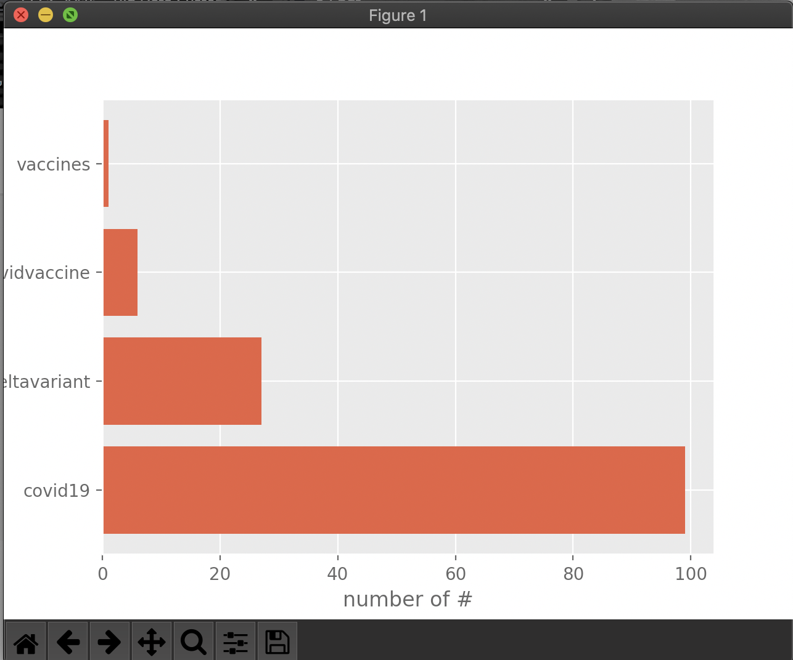
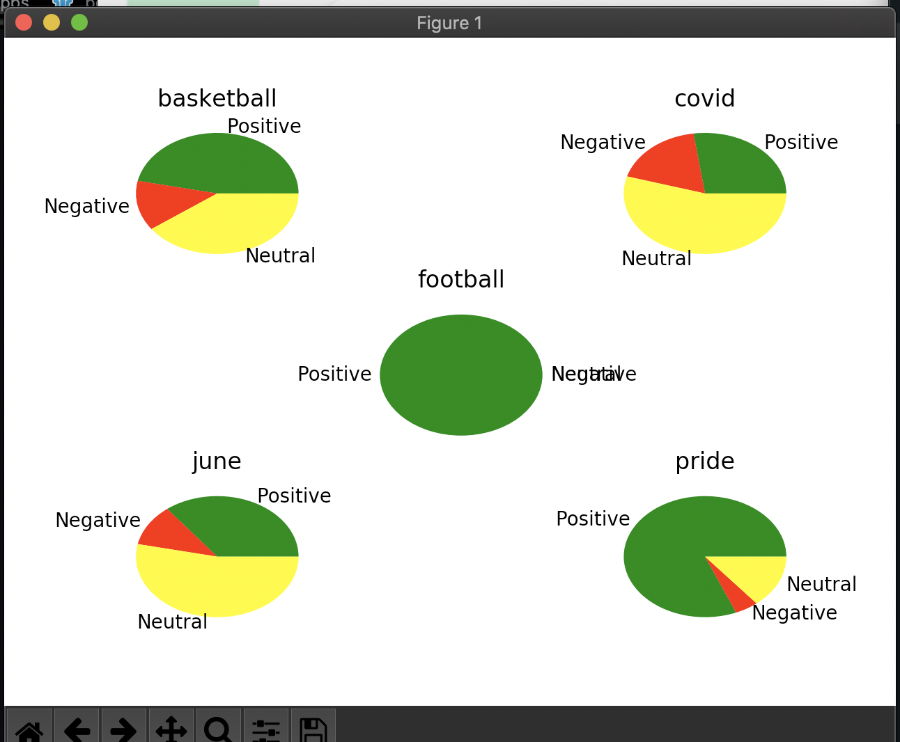

Execution: We have implemented the post processing batch analysis method, where we read the data from file and plot it. 

Steps to run part A

Files to run: twitter_app.py, spark_app.py, visual.py 

1. run `docker run -it -v $PWD:/app --name twitter -w /app python bash`
2. inside the docker container, run `pip install tweepy`
3. run `python twitter_app.py`
4. run another docker container and link it to the twitter container using `docker run -it -v $PWD:/app --link twitter:twitter eecsyorku/eecs4415`
5. run `spark-submit spark_app.py`
5. on your localhost, run `python install matplotlib`
6. run `python visual.py`

Make sure the filese in steps 3 and 4 are running when you run the file in step 6 to udpate the data dynamically

----------------------------------------------------------------------------------------

Steps to run part B

Files to run: b_twitter_stream.py, b_spark_stream.py, sentiment_visual.py 

1. run `docker run -it -v $PWD:/app --name twitter -w /app python bash`
2. inside the docker container, run `pip install tweepy`
3. run `python b_twitter_stream.py`
4. run another docker container and link it to the twitter container using `docker run -it -v $PWD:/app --link twitter:twitter eecsyorku/eecs4415`
5. run `spark-submit spark_app.py`
6. on your localhost, run `python install matplotlib` if you dont have matplotlib already installed
7. run `python sentiment_visual.py`

Make sure the filese in steps 3 and 5 are running when you run the file in step 6 to udpate the data dynamically

----------------------------------------------------------------------------------------

Output files added:
1. output_graph.txt (realtime data)
2. part_A_output_data.txt (shows data filtered through spark streaming with time stamps)
3. sentiment_output_graph.txt (realtime data)
4. sentiment_output_graph.txt (shows data filtered through spark streaming with time stamps)

### Results:

### Twitter trending tweets filtered based on hashtags

)

### Twitter sentiment analysis filtered based on hashtags for different topics

)
